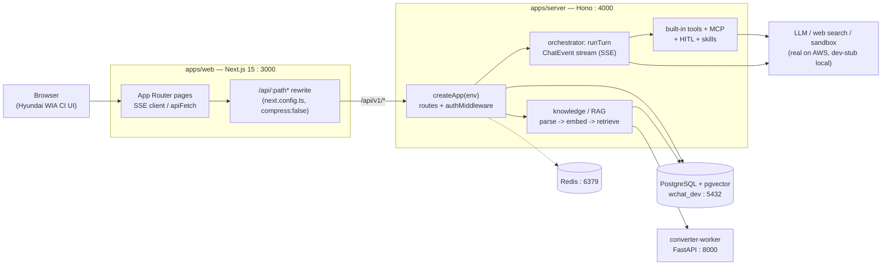
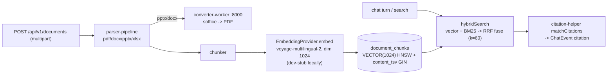
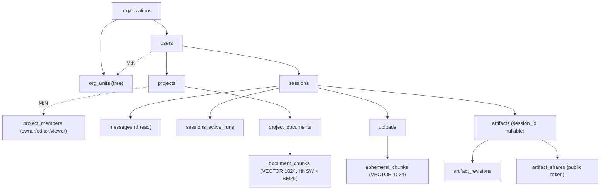

# WChat — System Architecture

WChat is an internal enterprise LLM agent chat platform for **Hyundai WIA**. It provides
agentic chat with tools, knowledge/RAG with inline citations, generated artifacts, MCP
connectors, reusable skills, and human-in-the-loop (HITL) approvals. The system is a
pnpm + Turborepo monorepo: a **Next.js 15** web app (App Router, Tailwind v4, Hyundai WIA
CI) talks through a same-origin `/api` proxy to a **Hono** API server, which drives an
async-generator **orchestrator** that streams `ChatEvent`s over SSE while executing built-in
and MCP tools. Persistence is **PostgreSQL + pgvector** with row-level security (RLS) for
org multi-tenancy; a Python **converter-worker** handles document conversion for RAG ingest.

> **Status: LOCAL_ONLY dev, AWS deploy target.**
> Everything in this document is **as-built** and verified running locally on macOS. External
> providers (Voyage embeddings, S3 object store, E2B sandbox, Tavily search, real Anthropic
> LLM, SES/SMTP email) are replaced by dev-stubs / in-memory fakes for local development and
> are swapped for real providers at AWS deploy time. AWS provisioning itself is a permanent
> human-gated task — see [Build / Test / Dev / Deploy](#10-build--test--dev--deploy).
> This file documents the **implementation**; the plan/spec lives under
> [`rebuild_plan/`](../rebuild_plan/) (linked throughout, not duplicated here).

---

## 1. High-level architecture



- **Browser -> web:3000**: the user loads the Next.js app; all API traffic is issued to
  same-origin `/api/...` and rewritten to the server (keeps SSE un-buffered, no CORS).
- **web -> server:4000**: `apps/web/next.config.ts` rewrites `/api/:path*` to
  `http://localhost:4000/api/:path*` (target overridable via `NEXT_PUBLIC_API_BASE`).
- **server -> Postgres/Redis**: all durable state in Postgres (pgvector for RAG); Redis is
  the deployment backing for run/HITL/resume registries (in-memory locally — see gotchas).
- **server -> converter-worker:8000**: PPTX/DOCX -> PDF conversion during document ingest.
- **server -> LLM/tools**: Anthropic (or dev-stub), Tavily web search (or dev-stub), E2B
  sandbox (or dev-stub), all cancellable via a single `AbortSignal` fan-out.

---

## 2. Monorepo layout

pnpm workspaces + Turbo. `apps/converter-worker` is **deliberately excluded** from the pnpm
workspace and Turbo graph (it is Python/Poetry). See
[`pnpm-workspace.yaml`](../pnpm-workspace.yaml), [`turbo.json`](../turbo.json),
and [`rebuild_plan/05-REPO-STRUCTURE.md`](../rebuild_plan/05-REPO-STRUCTURE.md).

| Path                    | Tech                                | Responsibility                                                                                                                                                             |
| ----------------------- | ----------------------------------- | -------------------------------------------------------------------------------------------------------------------------------------------------------------------------- |
| `apps/server`           | Hono + TypeScript (tsx)             | HTTP/SSE API, orchestrator, tools, MCP, RAG, DB access, auth. Composition root: `src/app.ts`.                                                                              |
| `apps/web`              | Next.js 15 / React 19 / Tailwind v4 | App Router UI, SSE streaming client, Hyundai WIA CI design system.                                                                                                         |
| `apps/converter-worker` | Python 3.12 / Poetry / FastAPI      | Document conversion (LibreOffice `soffice`) for RAG ingest. Off the pnpm/Turbo graph.                                                                                      |
| `packages/interfaces`   | TypeScript (types only)             | **FROZEN** single source of truth for all contracts: `DataAccess`, `AgentTool`, `LLMProvider`, `ChatEvent`, `WChatError`, etc. Human-gated.                                |
| `packages/shared`       | TypeScript (zod planned)            | **FROZEN**. Currently an empty stub (`export {}`); the Zod HTTP-DTO schemas that `16-API-CONTRACT` names as runtime source-of-truth are **not yet authored**. Human-gated. |

> **Frozen packages (hard rule).** `packages/interfaces` and `packages/shared` are frozen by
> path-ownership: any task that needs to change them must be isolated to a human gate rather
> than implemented (see [`CLAUDE.md`](../CLAUDE.md)). There is no literal `FROZEN` marker —
> the freeze is enforced by process, established by the Phase 0.5 Contract Bootstrap
> (commit `7e4a27b`, tag `v1.0-S00-setup`).

---

## 3. Runtime topology & ports

Verified live on macOS (LOCAL_ONLY). On this machine Postgres/Redis are served by Homebrew
(`postgresql@16` + `redis`); `docker-compose.local.yml` (pgvector + redis) is the equivalent
containerized path — either is valid as long as 5432 serves `wchat_dev` (with pgvector) and
6379 serves Redis.

| Component            | Tech                         | Port     | How started                                                                                                                             |
| -------------------- | ---------------------------- | -------- | --------------------------------------------------------------------------------------------------------------------------------------- |
| Web app              | Next.js 15 (App Router)      | **3000** | `pnpm dev` -> `turbo run dev --parallel` -> `next dev --port ${WEB_PORT:-3000}`                                                         |
| API server           | Hono via `@hono/node-server` | **4000** | `pnpm dev` -> `tsx watch --env-file=../../.env.local --env-file=.env.local src/index.ts` (binds `env.PORT`)                             |
| Converter worker     | FastAPI / uvicorn            | **8000** | `pnpm dev:full` (NOT `pnpm dev`) -> `poetry run uvicorn src.main:app --port ${WORKER_PORT:-8000}`                                       |
| Database             | PostgreSQL 16 + pgvector     | **5432** | Homebrew `postgresql@16` **or** `docker compose -f docker-compose.local.yml up -d --wait`. DB `wchat_dev`, user `wchat`, pw `localdev`. |
| Cache / registries   | Redis 7                      | **6379** | Homebrew `redis` or the same docker compose stack                                                                                       |
| Playwright preview   | Next `/preview` gallery      | **3100** | `bash scripts/verify-browser.sh` (isolated from dev :3000)                                                                              |
| RDS via SSM tunnel   | (deploy path)                | 15432    | `pnpm tunnel` — AWS only, unused under LOCAL_ONLY                                                                                       |
| Redis via SSM tunnel | (deploy path)                | 16379    | `pnpm tunnel` — AWS only, unused under LOCAL_ONLY                                                                                       |

Stop the dev stack by killing the `turbo run dev` pid. Watch for **port squatters**: another
project's Next server may already hold 3000 — check `lsof -ti tcp:3000` / `tcp:4000` and kill
only WChat's own process (cwd under this repo).

Health surface: server `GET /health` -> `200` (static stub, see §6), `GET /api/v1/_ping` ->
`{ok:true,env}`. Note it is `/api/v1/_ping`, **not** `/api/v1/health`.

---

## 4. Request & data flows

### 4a. Auth — magic-link, dev-login, JWT cookies

Auth is magic-link-first with JWT session cookies. The `/api/v1/auth` router is mounted
**outside** `authMiddleware`. Cookie name and JWT issuer derive from
`process.env.PROJECT_SLUG` (default `wchat`) — these are runtime-only and not in the zod env
schema. See [`routes/auth.ts`](../apps/server/src/routes/auth.ts),
[`middleware/jwt.ts`](../apps/server/src/middleware/jwt.ts).

```mermaid
sequenceDiagram
  participant U as Browser
  participant A as /api/v1/auth (unauth)
  participant DB as Postgres
  U->>A: POST /signup or /magic-link {email}
  A->>DB: store sha256(token), send link -> APP_ORIGIN/.../verify
  U->>A: GET /magic-link/verify?token=...
  A->>DB: validate (unused, unexpired), upsert user
  A->>A: issueSession() — insert refresh-token-family, sign JWTs
  A-->>U: Set-Cookie wchat_at (path=/, 15m) + wchat_rt (path=/api/v1/auth/refresh, 30d)
  A-->>U: 302 -> '/' (relative, host-preserving)
  Note over U,A: Later: 401 on access expiry -> POST /refresh rotates family;<br/>reused jti => revoke family 'theft_suspected' + 401 REFRESH_TOKEN_REUSED
```

- **Cookies**: `wchat_at` (HttpOnly, SameSite=Lax, path `/`, 15m, `Secure` in prod only),
  `wchat_rt` (HttpOnly, SameSite=Lax, path `/api/v1/auth/refresh`, 30d).
- **JWT** (HS256, `JWT_SECRET`): `AccessTokenPayload {iss,sub,org,role,scope:'access',iat,exp,jti}`,
  `RefreshTokenPayload` adds `family` + `scope:'refresh'`; verify rejects the wrong scope.
- **Refresh rotation** uses `refresh_token_families` for theft detection (reused generation ->
  revoke whole family). Redirects are **relative** on purpose (host-preserving for
  localhost / Tailscale MagicDNS / reverse proxy); only the magic-link email body uses
  absolute `APP_ORIGIN`.
- **dev-login** (`GET /api/v1/auth/dev-login[?email=...]`): 302 `/` + sets cookies as
  `dev@wchat.dev` (role `owner`, "Dev Org"), auto-creating org+owner on a fresh DB. Active
  only when `NODE_ENV !== 'production'` (404 in prod). The `/login` page renders a dev-login
  link.
- `GET /api/v1/auth/me` does **not** use `authMiddleware`; it has its own `authenticate()`
  helper reading the access cookie (the auth router is mounted outside the middleware).

### 4b. Agentic chat turn — end to end

A chat turn is one SSE response driven by the orchestrator loop. Entry:
[`routes/messages.ts`](../apps/server/src/routes/messages.ts) ->
[`orchestrator/orchestrator.ts` `runTurn`](../apps/server/src/orchestrator/orchestrator.ts).

```mermaid
sequenceDiagram
  participant W as Web (useSessionStream)
  participant M as POST /sessions/:id/messages (SSE)
  participant O as runTurn (async generator)
  participant P as LLMProvider.chat
  participant T as Tools (built-in / MCP)
  W->>M: POST body {content, model?}, credentials:include
  M->>M: ensureSession upsert, validate model vs org.allowedModels
  M->>M: assemble tools + ToolContext + BudgetClaim; registerRun(sessionId) AbortController
  M->>O: runTurn({provider, messages, tools, signal, ...})
  loop until stop.reason != 'tool_use'
    O->>P: provider.chat(input, signal)
    P-->>O: message_start / text_delta / tool_use / stop
    O-->>M: yield ChatEvent  --> SSE `event:<type>` frames (+ 10s ': ping')
    alt tool_use pending
      O->>T: allow-policy tools in parallel (Promise.all) / hitl serial (approval)
      T-->>O: tool_result (+ live tool_progress); duck-typed -> citation / artifact_created
      O->>P: re-invoke with appended tool_result
    end
  end
  O-->>M: stop
  Note over W,M: DELETE /sessions/:id/active-run -> abortRun() (Stop button).<br/>GET /sessions/:id/messages/:messageId/stream resumes (message_replace catch-up).
```

The web client parses SSE by hand (POST + `getReader()` + `TextDecoder`, splitting frames on
`\n\n`, reading `event:` / `data:` lines) — not `EventSource`, because the request is a POST.
See [`hooks/useSessionStream.ts`](../apps/web/src/hooks/useSessionStream.ts). Details of the
loop, tool policy, and cancellation are in [§6 Agentic core](#6-agentic-core).

### 4c. Knowledge / RAG — ingest -> embed -> retrieve -> cite

Two RAG lanes: **project documents** (persistent) and **session uploads** (ephemeral,
cascade-deleted with the session). See
[`apps/server/src/knowledge/`](../apps/server/src/knowledge/) and
[`routes/documents.ts`](../apps/server/src/routes/documents.ts).



- **Ingest**: `POST /api/v1/documents` parses (`parser-pipeline`, 415 on unsupported),
  chunks, embeds, and indexes **synchronously** locally (`indexStatus='indexed'`, no queue) —
  a queue is a deploy concern.
- **Retrieve**: `DocumentChunkRepo.hybridSearch` / `EphemeralChunkRepo.hybridSearchUnified`
  combine pgvector cosine (HNSW `m=16, ef_construction=64`) with BM25 (`tsvector` + GIN) via
  **Reciprocal Rank Fusion** (`rrfScore`, default `k=60`); results surface as
  `HybridSearchResult` / the `SearchHit = project | ephemeral` union.
- **Cite**: `knowledge/citation-helper.ts` `matchCitations` drops hallucinated `[N]` markers;
  surviving citations become `citation` `ChatEvent`s (`source: 'project' | 'ephemeral'`).

---

## 5. Backend

Composition root [`apps/server/src/app.ts` `createApp(env)`](../apps/server/src/app.ts)
builds one root `Hono` app, instantiates the whole dependency graph inline (Pg data-access
adapters, LLM provider registry, MCP pool/bridge, artifact stores, parser pipeline, embedding
provider, skill registry, built-in tools), and mounts routers. Process entry
[`src/index.ts`](../apps/server/src/index.ts) calls `loadEnv()`
([`src/env.ts`](../apps/server/src/env.ts) — zod `safeParse`, `console.error` + hard
`process.exit(1)` on failure) then `serve({ fetch: app.fetch, port: env.PORT })`. `createApp`
is also called directly by tests via `app.request()`.

### API surface (grouped)

Full contract: [`rebuild_plan/16-API-CONTRACT.md`](../rebuild_plan/16-API-CONTRACT.md).
Every new route file has **two hard requirements** (per [`CLAUDE.md`](../CLAUDE.md)): mount it
in `createApp`, **and** add its prefix to `EXPECTED_ROUTES` in
[`__tests__/routes-mounted.test.ts`](../apps/server/src/__tests__/routes-mounted.test.ts),
or the mount guard fails.

| Group                             | Prefix                                  | Auth                    | Notes                                                                       |
| --------------------------------- | --------------------------------------- | ----------------------- | --------------------------------------------------------------------------- |
| Health                            | `GET /health`, `GET /api/v1/_ping`      | unauth                  | `/health` is a **static stub** (`deps: {...:'unknown'}`) — not a live probe |
| Auth                              | `/api/v1/auth`                          | **unauth**              | magic-link, refresh rotation, dev-login, `/me`, `/logout`                   |
| Public share                      | `/api/v1/share`                         | **unauth (token only)** | `GET /:token(/content)`; invalid -> 404, expired/revoked -> 410             |
| Chat                              | `/api/v1/sessions`                      | authed                  | SSE messages, HITL, active-run stop, resume stream, artifacts               |
| Projects                          | `/api/v1/projects`                      | authed                  | CRUD + members                                                              |
| Uploads                           | `/api/v1/uploads`                       | authed                  | multipart session attachments                                               |
| Documents                         | `/api/v1/documents`                     | authed                  | project RAG docs (synchronous index)                                        |
| Artifacts                         | `/api/v1/artifacts`                     | authed                  | signed download URL + owner-only share mgmt                                 |
| Memories / Quota / Usage / Errors | `/api/v1/{memories,quota,usage,errors}` | authed                  | user memories CRUD; quota; usage; client error report (202)                 |
| MCP servers                       | `/api/v1/mcp-servers`                   | authed                  | org-scoped registry, SSRF-validated on register                             |
| Skills / Skill assets             | `/api/v1/{skills,skill-assets}`         | authed                  | list + `SKILL.md` + binary assets                                           |
| Admin                             | `/api/v1/admin`                         | authed + role           | health/history, dashboard, users, tool-metrics (genuine 403)                |
| Config                            | `/api/v1/config`                        | authed                  | bootstrap config                                                            |

### Middleware / auth pipeline

There is **no global middleware** — no CORS, no request-logging, no global error handler, no
global `notFound`. Each authed prefix is its own sub-`Hono` whose first middleware is
[`authMiddleware`](../apps/server/src/middleware/auth-middleware.ts): it reads the
`{PROJECT_SLUG|'wchat'}_at` cookie, `verifyAccessToken` (HS256 + issuer + `scope==='access'`),
and either `c.set('auth', payload)` or returns `401 {error:{code:'UNAUTHENTICATED',category:'auth'}}`.
Handlers read the actor via `c.get('auth')` (`.sub`=userId, `.org`=orgId, `.role`) and
delegate to `*-service` / `*-data-access` layers that enforce RLS/ownership.

### Error model

Contracts live in
[`packages/interfaces/src/errors.ts`](../packages/interfaces/src/errors.ts).

- **Success envelope**: `{ data: <payload>, meta: { requestId: uuid, nextCursor?: string } }`.
- **HTTP error envelope**: `{ error: { code, category, message, retryable } }` — note
  `requestId` / `details` from `SerializedError` are **not** included in HTTP error bodies.
- `SerializedError` (wire): `{ code, category, message, retryable, requestId?, details? }`.
- `WChatError` is the runtime class; `ErrorCategory` has **11 buckets**:
  `auth | tool | db | mcp | sandbox | rate-limit | external-api | parser | orchestrator | http | system`.
- **Ownership -> 404**: authorization failures on projects/uploads/documents/memories/mcp-servers
  are deliberately collapsed to `404` (not 403) to prevent existence-leaks; genuine role
  checks (all of `/admin`, admin usage) return `403 FORBIDDEN`.

> **Gotchas.** Each route file defines its own local `errorJson()`: `auth.ts` hardcodes
> `category:'auth'`, every other route hardcodes `category:'http'` regardless of the true
> failure domain — so **HTTP error category is not a reliable signal**. `requestId` is
> generated fresh per response (`randomUUID()` at serialization) — it is **not** request-scoped
> or correlated across a request. Uncaught throws fall through to Hono's default 500 text.
> `openapi.ts` / `buildOpenApi` exists but is **not** mounted as a runtime route.

---

## 6. Agentic core

The agentic subsystem drives a chat turn through a single async-generator loop,
[`runTurn`](../apps/server/src/orchestrator/orchestrator.ts), that yields the `ChatEvent`
union. `routes/messages.ts` relays each yielded event verbatim as an SSE frame
(`event:<type>` + `data:` = the event payload minus `type`). See
[`rebuild_plan/20-MULTI-AGENT-TOOL.md`](../rebuild_plan/20-MULTI-AGENT-TOOL.md).

### Orchestrator loop

`runTurn` calls `LLMProvider.chat(input, signal)` (Anthropic SDK stream mapped to
`ChatEvent`s). When the model stops with reason `tool_use` it executes pending tools, appends
`tool_result`s, and re-invokes the provider until a non-tool stop. Tool segmentation:
adjacent **allow-policy** tools run in **parallel** (`Promise.all`); **hitl-policy** tools run
**serially**, each gated by an approval round-trip (their `tool_use` is suppressed from the
stream until approved). `runTurn` duck-types tool JSON results (`{citations:[...]}`,
`{artifact:{...}}`) into `citation` / `artifact_created` events — tools never emit those
directly.

### Tool system

Uniform contract:
`AgentTool { spec: AgentToolSpec; invoke({toolCallId, args, ctx: ToolContext}) }`. `ctx.signal`
is mandatory (lesson L06); `ctx.emitProgress?` is optional. Tools are pre-validated against
`inputSchema` (`SCHEMA_INVALID` short-circuit) and wrapped in a `gen_ai.*` span + tool-metrics.

- **Built-in** ([`tools/assemble-builtin-tools.ts`](../apps/server/src/tools/assemble-builtin-tools.ts)):
  `artifact_create`, `web_search` (Tavily or dev-stub), `code_interpreter` (E2B sandbox or
  dev-stub), `deep_research`.
- **MCP** ([`mcp/`](../apps/server/src/mcp/)): per-request, org-scoped, `defaultPolicy:'hitl'`
  by default. Assembled per-request and re-filtered to the caller's org
  (`assembleOrgMcpTools`) because `mcpBridge.listRegisteredTools()` is a global registry —
  a cross-org tool-leak guard. **SSRF is re-validated on every discover/invoke**
  ([`url-validator.ts`](../apps/server/src/mcp/url-validator.ts): protocol allowlist
  https-only in prod, DNS resolve, RFC-1918/loopback/link-local/metadata denylist, returns
  `resolvedIps` for rebind protection). Rug-pull detection tags specs `description-changed`.

### deep_research

[`tools/handlers/deep-research-handler.ts`](../apps/server/src/tools/handlers/deep-research-handler.ts)
is a facade over `runTurn`: planner -> parallel isolated researcher `runTurn`s (each scoped to
read-only `web_search`) -> synthesis -> optional gap-reflection loop (hard-capped at
`maxGapIterations`, default 2). It emits live `tool_progress` swimlane snapshots and writes a
markdown artifact. Hang protection: a **300s** linked `AbortSignal` unwinds every sub-turn; on
timeout the error propagates to the messages route as an explicit SSE `error` frame
(`TURN_FAILED`, retryable) rather than a hung stream.

### SSE + AbortSignal cancellation, tool_progress

- **Cancellation** is a single `AbortController` fan-out.
  [`run-registry.ts`](../apps/server/src/orchestrator/run-registry.ts) maps
  `sessionId -> controller`; the **Stop** button (`DELETE /sessions/:id/active-run`) or an HTTP
  disconnect calls `abort()`. The same signal threads into `provider.chat`, every
  `tool.invoke` `ctx.signal`, and nested `runTurn`s.
  [`consume-until-abort.ts`](../apps/server/src/orchestrator/consume-until-abort.ts) races each
  generator `.next()` against the abort so even a non-cooperative provider halts immediately.
- **tool_progress** uses a single-consumer async queue (`createProgressChannel`): only
  allow-segment tools get a real `emitProgress`; hitl invokes and nested worker `runTurn`s pass
  a context **without** `emitProgress` (worker isolation — inner tool_use/result/stop never
  reach the parent SSE stream; only accumulated `text_delta` escapes as the `tool_result`).
- **SSE resume** ([`message-run-registry.ts`](../apps/server/src/orchestrator/message-run-registry.ts))
  is single-subscriber (409 on concurrent subscribe, 410 when terminal) and in-memory
  (lost on restart locally; Redis-backed in deployment). `run-registry` and the HITL bridge
  are likewise in-memory singletons locally.

> **Building blocks not wired to prod.** `createWorkerTool`, `runDag` (dag-planner),
> `selectRelevantTools` (tool-router), evaluator-optimizer, routing-handoff, and
> `reliabilityGuards` (MAST: max-steps / step-repetition / reasoning-action) exist and are
> tested but are **not** in the live message path. The live turn is `runTurn` + the 4 built-in
> tools + MCP tools; `deep_research` is the only multi-agent facade actually assembled.
> MAST guards are **off** in prod (`messages.ts` does not set `reliabilityGuards`).

---

## 7. Knowledge / RAG

See §4c for the ingest/retrieve/cite flow and [`knowledge/`](../apps/server/src/knowledge/).
Data model: [`rebuild_plan/06-DATA-MODEL.md`](../rebuild_plan/06-DATA-MODEL.md).

- **Two embedding columns**, both `VECTOR(1024)` (voyage-multilingual-2), both HNSW cosine
  (`m=16, ef_construction=64`): `document_chunks.embedding` (nullable, filled during indexing)
  and `ephemeral_chunks.embedding` (NOT NULL, session-scoped, cascade-deleted with session).
- **Hybrid search** = vector + BM25. `document_chunks.content_tsv` is a
  `GENERATED ALWAYS ... STORED` `tsvector` with a GIN index; fusion is **RRF** (default `k=60`).
- **Citations**: `matchCitations` drops unmatched `[N]` markers before emitting `citation`
  events; web-search results are approximated as `source:'ephemeral'` + `sourceUri` (adding a
  real `citation.source:'web'` would be a frozen-contract change).

### LOCAL_ONLY stub vs real provider

| Concern        | LOCAL_ONLY (this repo, verified)                                               | AWS deploy (swap-in)                      |
| -------------- | ------------------------------------------------------------------------------ | ----------------------------------------- |
| Embeddings     | `knowledge/embedding-provider-dev-stub.ts` (`createDevStubEmbeddingProvider`)  | Voyage `voyage-multilingual-2` (dim 1024) |
| LLM            | dev-stub provider when `ANTHROPIC_API_KEY` unset (no network)                  | real Anthropic via `@anthropic-ai/sdk`    |
| Web search     | dev-stub when `TAVILY_API_KEY` unset                                           | Tavily REST                               |
| Code sandbox   | dev-stub when `E2B_API_KEY` unset                                              | E2B (egress off by default)               |
| Object store   | `lib/object-store.ts` `createLocalObjectStore`                                 | S3                                        |
| Artifact store | s3 store **emulated** over local object store, HMAC-signed 60s download tokens | real S3 presigned URLs                    |
| Email          | Console sender (`EMAIL_SENDER_KIND`)                                           | SES / SMTP                                |
| Doc index      | **synchronous** in `POST /documents`                                           | queue-backed                              |

---

## 8. Frontend (apps/web)

Next.js 15 App Router. Design system single source: **`apps/web/DESIGN.md`** +
**`apps/web/design-reference/`** (the hi-fi handoff is the visual canon). See
[`apps/web/DESIGN.md`](../apps/web/DESIGN.md).

### App Router structure

Route groups under [`apps/web/src/app/`](../apps/web/src/app/):

| Segment                                      | Purpose                                                   |
| -------------------------------------------- | --------------------------------------------------------- |
| `(auth)/login`, `(auth)/signup`              | magic-link + dev-login entry                              |
| `(chat)/chat`                                | agentic chat surface (live SSE)                           |
| `projects`, `projects/[projectId]`           | projects + project RAG documents                          |
| `settings/{mcp,memories,quota,skills}`       | user/org settings                                         |
| `admin`, `admin/users`, `admin/tool-metrics` | admin console (role-gated)                                |
| `share/[token]`                              | public artifact share (unauth)                            |
| `preview`                                    | component gallery (Playwright browser gate target, :3100) |

Components are grouped by domain under
[`apps/web/src/components/`](../apps/web/src/components/) (`chat`, `sessions`, `projects`,
`artifacts`, `settings`, `admin`, `share`, `layout`, `home`, `auth`); domain data hooks under
[`apps/web/src/hooks/`](../apps/web/src/hooks/) (`useSessions`, `useProject`, `useDocuments`,
`useMcpServers`, `useQuota`, ...).

### SSE streaming client & apiFetch / refresh

- [`hooks/useSessionStream.ts`](../apps/web/src/hooks/useSessionStream.ts) POSTs the message
  and consumes the SSE body via `getReader()` + `TextDecoder`, splitting frames on `\n\n` and
  dispatching by `event:` name. It models messages as a **tree** (parent pointer + sibling
  order + active child) so message edit / branch-switch restore prior streamed branches. Its
  `Citation` / `ToolProgressState` / `HitlPromptData` shapes are 1:1 with the `ChatEvent`
  variants.
- [`lib/fetch-with-refresh.ts`](../apps/web/src/lib/fetch-with-refresh.ts) `apiFetch` wraps
  `fetch` with `credentials:'include'`; on `401` it calls `POST /api/v1/auth/refresh` **once**
  (deduped across concurrent 401s) and retries the original request once — the refresh
  endpoint itself is never retried (loop guard). On refresh failure the original 401 is
  returned so the caller can route to `/login`.
- The web->server proxy ([`apps/web/next.config.ts`](../apps/web/next.config.ts)) sets
  `compress:false` so proxied `text/event-stream` is not gzip-buffered.

### Design token system (Hyundai WIA CI)

All color comes from semantic tokens in
[`apps/web/src/app/globals.css`](../apps/web/src/app/globals.css) `@theme` (Tailwind v4) —
**no hardcoded hex**. Brand: `primary` = Hyundai WIA Blue `#00287A` (main — headers, CTAs,
links, focus); `accent`/`danger` = Hyundai WIA Red `#C8102E` (Stop / danger / live status,
small-area only). A full `primary-50…900` scale, neutral grays, `success`/`warning`, and a
navy-tinted dark theme are registered. Typography: **Pretendard** (Hangul + Latin, self-host;
the licensed Hyundai WIA face is not shipped). The official logo must not be reproduced or
altered — a text wordmark (primary color) is used absent company assets.

---

## 9. Contracts & data model

### Frozen type contracts — `packages/interfaces`

[`packages/interfaces/src/`](../packages/interfaces/src/) is the frozen single source of truth
(barrel `index.ts`; import via `@wchat/interfaces`). Documented mirror:
[`rebuild_plan/14-INTERFACES.md`](../rebuild_plan/14-INTERFACES.md).

- **`DataAccess`** facade — 24 repos + `withTx()` + `withRlsContext({userId, orgId})`; generic
  `Repo<T,F> { insert, bulkInsert, update, delete, byId, list }` with `Pagination`/`Page<T>`.
  Composite-PK tables (`ProjectMemberRepo`, `SkillAssetRepo`) and search repos
  (`DocumentChunkRepo.hybridSearch`, `EphemeralChunkRepo.hybridSearchUnified`) get bespoke
  interfaces.
- **`ChatEvent`** — frozen discriminated union of **13 variants** (1:1 with SSE events):
  `message_start`, `message_replace`, `text_delta`, `tool_use`, `tool_result`,
  `tool_progress`, `hitl_request`, `hitl_resolved`, `hitl_timeout`, `citation`,
  `artifact_created`, `stop`, `error`. SSE payload = `ChatSsePayload<E> = Omit<Extract<ChatEvent,{type:E}>,'type'>`.
  `tool_progress` is snapshot-semantic (each event carries full current state; consumers
  replace, not accumulate).
- **Adapter contracts**: `AgentTool` / `ToolContext` / `AgentToolResult`
  (`text | json | file(artifactId) | error(WChatError)`); `LLMProvider.chat(ChatInput, signal)`;
  `SandboxTransport`; `EmbeddingProvider.embed(string[], {type})` (dim 1024);
  `ArtifactStore` (inline vs s3 at `sizeBytes < 256_000`); `HitlBridge.askApproval -> HitlDecision`
  (`approved|denied|timeout`); `BudgetClaim`; `SkillRegistry` + `SkillSpec`;
  `McpClientPool`; `Logger`; `EmailSender`.
- **Enums**: `PermissionTier`, `ToolPolicy` (`allow|hitl|deny`),
  `ActiveRunStatus` (`pending|running|cancelled|completed`), `Visibility` (`private|team|org`),
  `ProjectRole` (`owner|editor|viewer`).

> `AbortSignal` is mandatory throughout (L06): `ToolContext.signal`, `LLMProvider.chat`,
> `SandboxTransport.runCommand`, `DocumentChunkRepo.hybridSearch`, `HitlBridge.askApproval`,
> `McpClientPool.invoke` all take a signal.

### Database schema — Postgres + pgvector

**28 tables across 16 migrations (0001–0016)**, hand-written SQL under
[`apps/server/src/db/migrations/`](../apps/server/src/db/migrations/) (`db/schema.ts` is an
intentional empty stub — the DDL is **not** Drizzle table objects). DB access:
[`db/client.ts`](../apps/server/src/db/client.ts) exports `pgPool` / `db`. Data model spec:
[`rebuild_plan/06-DATA-MODEL.md`](../rebuild_plan/06-DATA-MODEL.md).



- **Org multi-tenancy via RLS.** Org is the isolation root. Every table has RLS `ENABLE`
  (identity tables `organizations`/`org_units`/`users`/`user_org_units` also `FORCE`). Each
  request runs `SET LOCAL app.user_id / app.org_id` GUCs, read by policies via
  `NULLIF(current_setting('app.user_id',true),'')::uuid` (the `NULLIF` guards rolled-back GUCs
  returning `''` — a documented P1-T1-01 fix applied uniformly; the sole exception is the
  `rtf_owner` refresh-token policy). Policy self-recursion is broken by `SECURITY DEFINER`
  helpers (`current_user_is_admin`, `user_role_in_project`, `user_can_read/write_project`,
  `create_user_from_magic_link`, ...). Day-to-day queries run as a non-BYPASSRLS `app_user`,
  so RLS is genuinely enforced.
- **Project visibility** is a 3-tier RLS matrix: `org` (anyone in org), `team` (users sharing
  the project's `org_unit`), `private` (`project_members` only).
- **Migration apply order != filename order** (see
  [`migrations/meta/_journal.json`](../apps/server/src/db/migrations/meta/_journal.json)):
  `0001, 0012, 0013, 0002, 0003, 0004, 0015, 0005, 0014, 0006…0011, 0016` — auth (0012/0013)
  applies right after identity; RLS-refine 0015 before 0005 (idempotent via `to_regclass`
  guards).
- **Artifact storage** is a CHECK constraint: exactly one of
  (`storage_kind='inline'` + `inline_content`) or (`storage_kind='s3'` + `s3_key`);
  `artifacts.session_id` is nullable `ON DELETE SET NULL` so artifacts survive session
  deletion (L03).

> **DB vs API shapes.** `packages/interfaces` holds **DB Record** types (Date objects,
> server-only fields like `s3Key`/`tokenHash`); the parallel HTTP **DTO** Zod schemas that
> `16-API-CONTRACT` designates as runtime source-of-truth are **not yet authored**
> (`packages/shared` is an empty stub). Server mappers at `apps/server/src/mappers/*` convert
> Record -> DTO.

---

## 10. Build / test / dev / deploy

Monorepo tooling: pnpm `10.28.2` + Turbo (`turbo run <task>`), Node `>=22`. See
[`package.json`](../package.json), [`turbo.json`](../turbo.json), and
[`rebuild_plan/10-DEV-WORKFLOW.md`](../rebuild_plan/10-DEV-WORKFLOW.md).

- **Run**: `pnpm dev` (web:3000 + server:4000 + `packages/{shared,interfaces}` tsc --watch);
  `pnpm dev:full` adds the converter-worker. `pnpm build | test | typecheck | lint` fan out
  through Turbo. `pnpm db:migrate` applies migrations (`pnpm db:seed` is currently a **dangling**
  script — no server `db:seed` target exists).
- **Gates**: `bash scripts/verify-gates.sh` is the deterministic commit/CI oracle
  (typecheck + lint + test + `validate-state.sh`); exit `0` required before commit
  (~361 web + ~632 server tests). `bash scripts/verify-browser.sh` runs a Playwright headless
  smoke on the `/preview` gallery (:3100). `scripts/load-test.mjs` (`pnpm load:100|1000`)
  asserts p95 < 500ms against `/api/v1/_ping`.
- **Git hooks**: git-native via `core.hooksPath=.githooks` (**not Husky**; set by
  `scripts/setup-hooks.sh` on `pnpm install`). [`.githooks/pre-commit`](../.githooks/pre-commit)
  runs `check-dev-deploy-rules.sh` (macOS-only commits unless `ALLOW_NON_MAC_COMMIT=1`, secret
  scanning) then lint-staged. See [`docs/DEV-DEPLOY-RULES.md`](./DEV-DEPLOY-RULES.md).
- **CI**: [`.github/workflows/ci.yml`](../.github/workflows/ci.yml) runs
  typecheck/lint/test/build (frozen lockfile) + gitleaks + semgrep + trivy on ubuntu.
- **LOCAL_ONLY vs AWS split**: everything runs against the local pgvector+redis stack.
  `project.config.yaml` carries `LOCAL_ONLY_*_PENDING` sentinels;
  [`.github/workflows/deploy.yml`](../.github/workflows/deploy.yml) is `workflow_dispatch`-only
  and its guard job **fails while those sentinels are present**. `scripts/tunnel.sh`
  (SSM port-forward to RDS/Redis) is the deploy path, unused today. AWS provisioning is a
  permanent human-gate. Deploy spec:
  [`rebuild_plan/11-DEPLOYMENT.md`](../rebuild_plan/11-DEPLOYMENT.md).

### Autonomous build loop (.ralph)

This codebase was built by a Ralph-style autonomous loop: `scripts/loop.sh` runs fresh-context
`claude -p PROMPT.<phase>.md` iterations that pick one unblocked `passes=false` feature from
[`feature_list.json`](../feature_list.json) (136-item ledger; only `passes false->true` and
`attempts+1` mutations allowed, guarded by `validate-state.sh`), do TDD, run `verify-gates.sh`,
commit, and emit `<PHASE_COMPLETE:{phase}>` / `<PHASE_BLOCKED:{phase}>` / `<ALL_TASKS_COMPLETE>`
signals. `scripts/loop-watchdog.sh` kills hung vitest/playwright (verify-gates has no timeout;
an unclosed SSE `ReadableStream` can stall it). See
[`rebuild_plan/21-LOOP-LESSONS.md`](../rebuild_plan/21-LOOP-LESSONS.md) and
[`CLAUDE.md`](../CLAUDE.md).

---

## 11. Cross-references

- [`CLAUDE.md`](../CLAUDE.md) — agent/build rules, path ownership, blocker-isolation protocol.
- [`README.md`](../README.md) — project overview, quickstart, and docs index.
- [`apps/web/DESIGN.md`](../apps/web/DESIGN.md) + [`apps/web/design-reference/`](../apps/web/design-reference/) — Hyundai WIA CI design system (visual canon).
- [`docs/DEV-DEPLOY-RULES.md`](./DEV-DEPLOY-RULES.md) — dev = macOS local, deploy = AWS; the pre-commit enforcement.
- [`rebuild_plan/14-INTERFACES.md`](../rebuild_plan/14-INTERFACES.md) — type/interface contract mirror (`packages/interfaces`).
- [`rebuild_plan/16-API-CONTRACT.md`](../rebuild_plan/16-API-CONTRACT.md) — REST/SSE API contract.
- [`rebuild_plan/03-ARCHITECTURE.md`](../rebuild_plan/03-ARCHITECTURE.md) — planned/aspirational architecture (this file is the **as-built** counterpart).
- Also: [`08-SPRINT-PLAN`](../rebuild_plan/08-SPRINT-PLAN.md), [`06-DATA-MODEL`](../rebuild_plan/06-DATA-MODEL.md), [`09-TDD-GUIDE`](../rebuild_plan/09-TDD-GUIDE.md), [`20-MULTI-AGENT-TOOL`](../rebuild_plan/20-MULTI-AGENT-TOOL.md).
